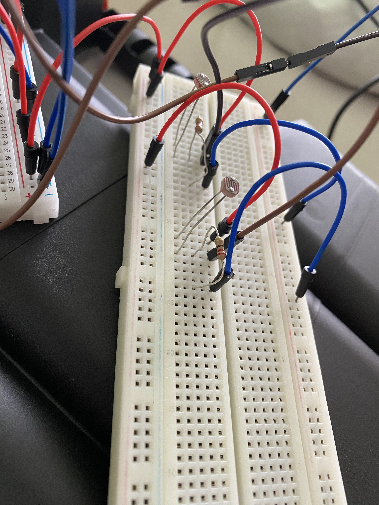
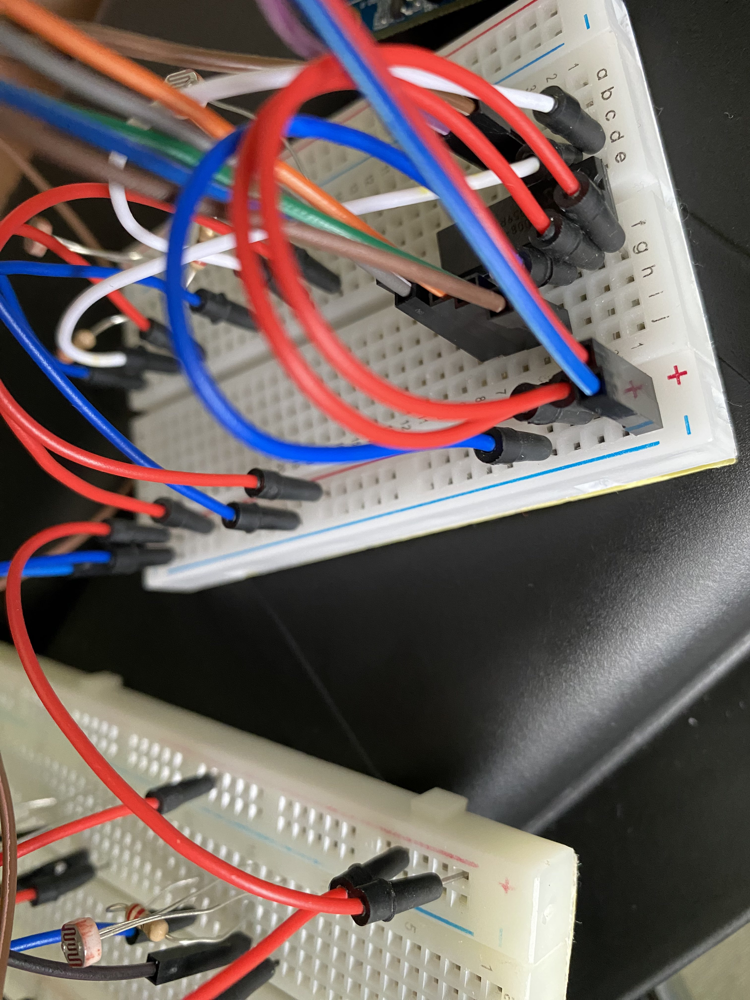
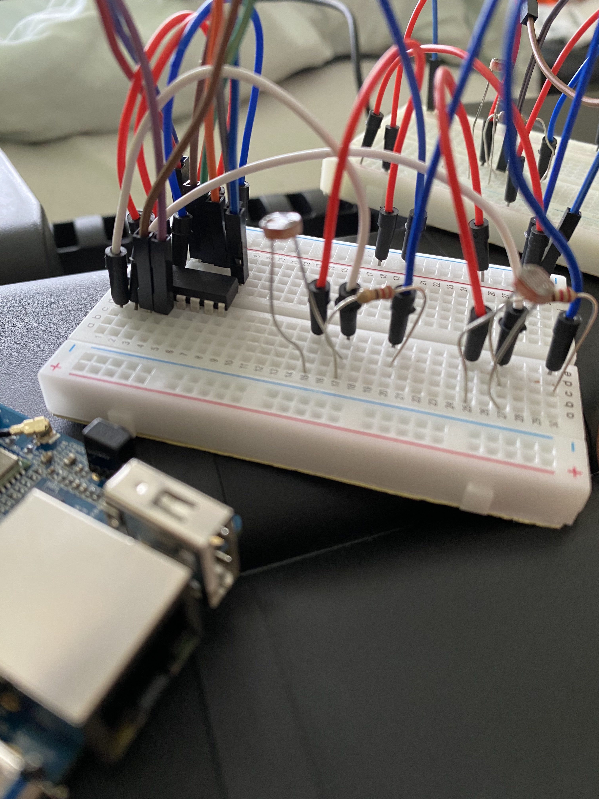
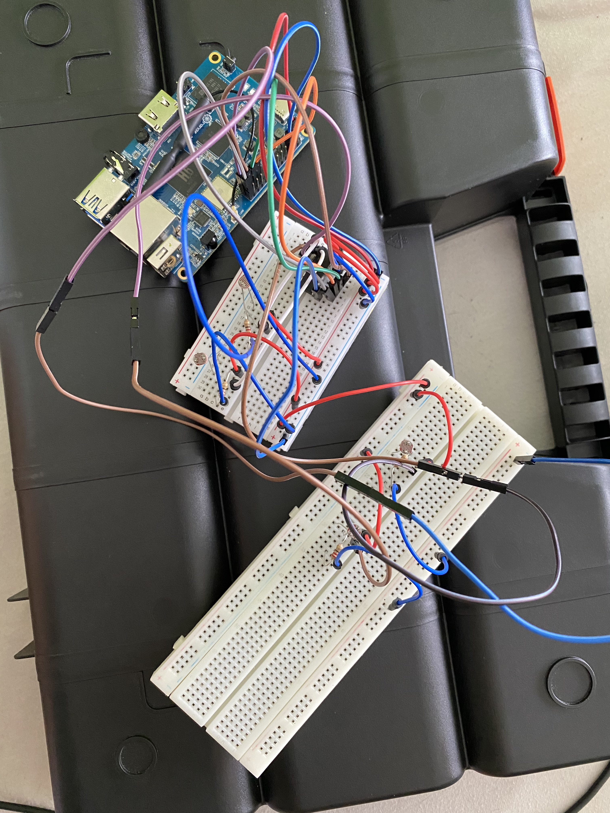
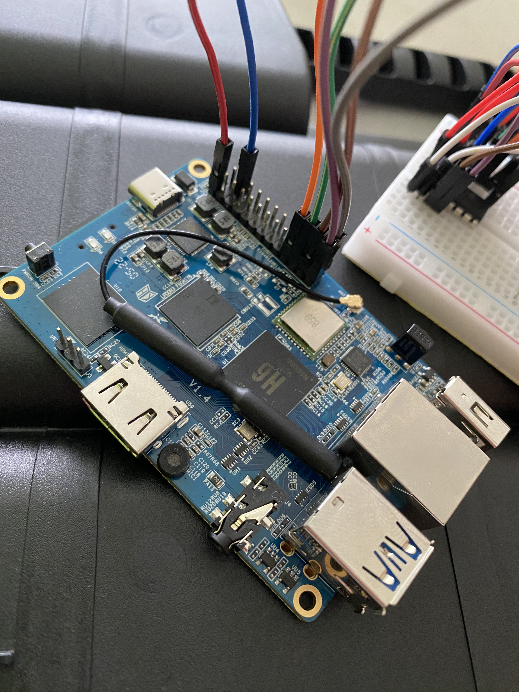
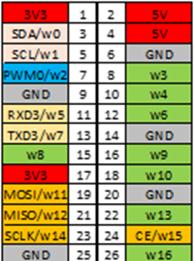

# Professional Skills 1 - Chess

This is the official repository for our chess game.
The main file is the chess program. The idea is to have a beamer above a physical chess board that projects an active game on a board that has 64 light sensors in it (we use LDR sensors). The sensors are protected by a plate running over the entire board and is easily cleanable. The sensors need to be linked to a microcomputer (in our case the Orange Pi 3 LTS). Once the setup is ready you can launch the program and you can play a game of chess. The game is played between two players, but with extra tweaking you could add a bot. The beamer will display the positions of the pieces that are shown on the computer. This will also ensure that the sensors have enough light on them to notice a change in light levels. The game ends once someone has checkmate or 50 turns have passed.

## Demo
We have made a "demo" with 4 LDR sensors, each of them pointing to one square.
In the following diagram, you see where on the bigger board these sensors would be located, if we set up the whole thing with 64 sensors.

||a|b|c|d|e|f|g|h|
|:---|:---|:---|:---|:---|:---|:---|:---|:---|
|1|||||||||
|2|||||||||
|3|||||| f3|||
|4|||||||||
|5|||||||||
|6|||| d6|||||
|7|||| d7|| f7|||
|8|||||||||

De code of this demo (main.py) is written to do 4 moves automatically, and then continue with the sensors. The user selects the square **d7** and then hovers over the sensor appointed to **d6** to make the move. The same procedure follows for the moves  **Qf7-Qf3** (Q = queen)

Setup your Orange Pi 3 LTS as shown below, download the code and run it in a **__GUI instance ON the OPi__**, if this script is ran in a terminal that is unable to open a graphical interface, the script will fail. This is because it has to open a Firefox instance.

\* *Note: these PIP packages have to be installed for the program to work: `python-chess`, `requests`, `time`, `wiringpi`, `selenium`.*

### Physical setup
<!--  -->

### GPIO pins

